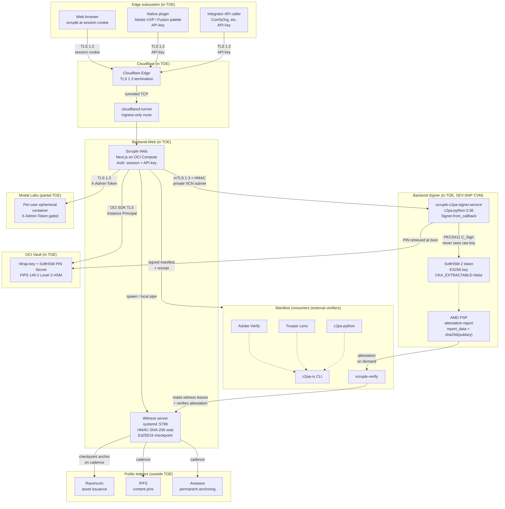
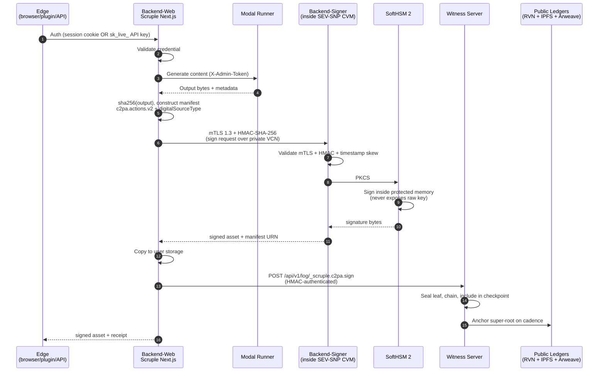
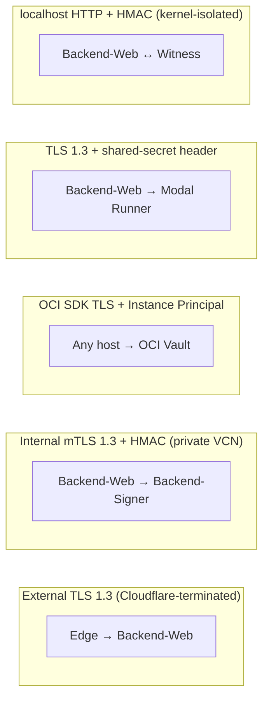

# Scruple TOE — architecture diagram

Companion to `../01-GPSA.md` §C.1.4. Same data flow, rendered as Mermaid
for viewers that prefer graphical representation.

## Trust boundaries



## Data flow — single C2PA sign event



## TLS + auth summary



## Legend

- Solid arrows: authenticated, encrypted request/response paths on
  the hot path.
- Dashed arrows: read-only or metadata paths.
- Trust boundaries shown as subgraphs; the CVM boundary is the
  cryptographic trust root, attested via AMD SEV-SNP.

## Rendering

To render as PNG:

```bash
npx -y @mermaid-js/mermaid-cli \
  -i architecture-diagram.md \
  -o architecture-diagram.png
```

Or paste any of the above blocks into `https://mermaid.live` for an
interactive view.
