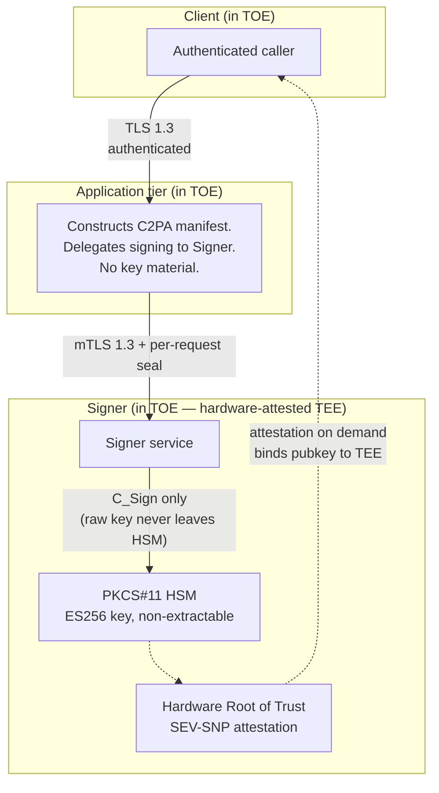

# Scruple TOE — architecture diagram

Companion to `../01-GPSA.md` §C.1.4. Black-box view of the trust
boundaries and mutual-authentication paths material to L1/L2
conformance.

## Boundaries and authentication

| Boundary | Protection |
|---|---|
| Client → Application tier | TLS 1.3, caller-authenticated |
| Application tier → Signer | mTLS 1.3 + per-request authentication seal, on an isolated network segment |
| Signer → HSM | PKCS#11 in-process, raw key never exposed |
| Signer / HSM → external verifier | Hardware Root of Trust attestation binding the specific HSM public key to the specific attested TEE |

## What the diagram is intended to convey (and only that)

- The end-entity signing key resides only inside a hardware-attested TEE.
- No component upstream of the TEE ever holds the raw key.
- Every subsystem boundary is mutually authenticated.
- The attestation report cryptographically proves the key ↔ TEE
  binding to any independent verifier without requiring Scruple's
  cooperation.

Detailed provisioning, ceremony, and operational procedures are
Scruple internal and are not required to demonstrate conformance
to §6 of the Generator Product Security Requirements.
